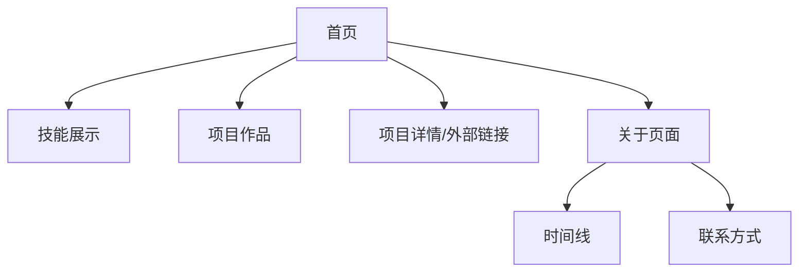

# 个人介绍网站 - 产品需求文档

## 1. 产品概述

一个采用 Material Design 3（MD3）设计的现代化静态个人介绍网站，展示个人品牌、专业技能与项目作品。

### 主要目的
- 打造专业、独特的个人品牌展示门户
- 展示技术技能与项目作品集
- 建立专业形象与个人影响力

### 目标用户
- 技术开发者、设计师、内容创作者
- 希望展示个人品牌的专业人士
- 需要在线作品集的自由职业者

---

## 2. 核心功能

### 2.1 功能模块（静态展示）
1. **首页**：个人介绍 Hero 区、技能展示、项目作品集
2. **关于页面**：详细个人介绍、时间线、联系方式
3. **项目页面**：全部项目展示页

### 2.2 页面详情
| 页面名称 | 模块名称 | 功能描述 |
|----------|----------|----------|
| 首页 | Hero 区域 | 全屏背景、动态渐变、姓名与标语、CTA 按钮 |
| 首页 | 技能展示 | 分类技能卡片、熟练度指示器、图标装饰 |
| 首页 | 项目作品 | 精选项目轮播/网格布局、项目缩略图与简介 |
| 项目页 | 项目展示 | 全部项目卡片网格、筛选标签、技术栈展示 |
| 关于页 | 个人介绍 | 本地头像、详细简介、社交链接 |
| 关于页 | 时间线 | 教育背景、工作经历、重要里程碑 |
| 关于页 | 联系方式 | 邮箱、社交媒体、GitHub 链接 |

---

## 3. 核心流程

### 3.1 用户浏览流程
```
用户访问首页 → 浏览 Hero 与技能展示 → 查看项目作品 → 访问关于页面
```

### 3.2 页面流程图


---

## 4. 用户界面设计

### 4.1 设计风格
**MD3 (Material Design 3) 核心要素**

| 设计维度 | 设计决策 |
|----------|----------|
| 设计系统 | Material Design 3 with dynamic color |
| 主题模式 | 深色/浅色主题切换，支持系统偏好 |
| 主色调 | 靛蓝色系 (#6750A4)，配合次要与强调色 |
| 圆角风格 | 中等圆角 (12-16px)，部分大圆角卡片 (24px) |
| 阴影层次 | MD3 Elevation 系统，3 级阴影 |
| 字体选择 | Google Fonts: Noto Sans SC + Roboto |
| 布局方式 | 响应式网格系统，最大宽度 1200px |
| 动效设计 | MD3 Motion: 容器变换、共享元素过渡、微妙反馈动画 |

### 4.2 页面设计概览

| 页面 | 模块 | 视觉风格 | 布局特点 |
|------|------|----------|----------|
| 首页 | Hero | 全屏沉浸式，动态渐变背景 | 垂直居中，大留白 |
| 首页 | 技能卡片 | MD3 Filled Card，图标+文字 | 网格布局，响应式列数 |
| 首页 | 项目卡片 | MD3 Outlined Card，悬停提升 | 2-3 列网格，缩略图突出 |
| 项目页 | 项目网格 | MD3 Outlined Card | 瀑布流/网格布局 |
| 关于页 | 头像 | 本地图片，圆角裁剪 | 居中或左侧布局 |
| 关于页 | 时间线 | MD3 组件，节点与连接线 | 垂直时间线，交替布局 |

### 4.3 响应式策略
- **桌面端** (≥1024px)：全功能展示，多列布局
- **平板端** (768-1023px)：双列网格，侧边栏收起
- **移动端** (<768px)：单列布局，汉堡菜单，触摸优化

### 4.4 MD3 组件清单
- TopAppBar（顶部应用栏）
- NavigationRail / NavigationBar（导航组件）
- Card（Filled/Outlined/Assist variants）
- Chip（Filter/Input variants）
- Button（Filled/Outlined/Text/Tonal variants）
- FAB（浮动操作按钮）
- Switch/Toggle（切换开关）
- Slider（滑块，用于技能熟练度）

---

## 5. 技术约束

### 5.1 完全本地化要求
- **头像图片**：使用本地 `public/images/` 目录下的图片
- **所有资源**：无外部 API 调用，纯静态资源
- **字体**：本地字体或 Google Fonts CDN（如允许）
- **图标**：MUI Icons 或 Lucide React（支持本地化）

### 5.2 性能目标
- 首屏加载时间 < 2s
- Lighthouse 性能评分 > 90
- 图片懒加载与优化格式

### 5.3 可访问性
- WCAG 2.1 AA 级兼容
- 键盘导航支持
- ARIA 标签完整

### 5.4 浏览器支持
- Chrome 90+
- Firefox 88+
- Safari 14+
- Edge 90+
