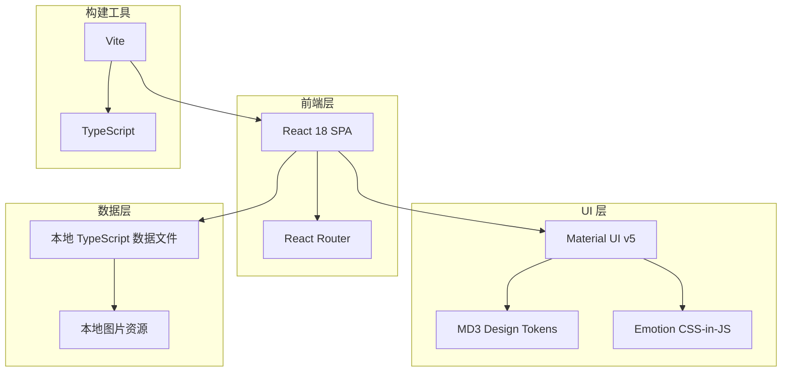

# 个人介绍网站 - 技术架构文档

## 1. 架构设计

### 1.1 系统架构图


### 1.2 技术栈选型

| 技术类别 | 技术选型 | 版本 | 说明 |
|----------|----------|------|------|
| 框架 | React | 18.x | 现代化组件化框架 |
| 构建工具 | Vite | 5.x | 极速开发体验 |
| 语言 | TypeScript | 5.x | 类型安全 |
| UI 库 | Material UI | 5.x | MD3 组件支持 |
| 样式方案 | Emotion | - | CSS-in-JS，与 MUI 深度集成 |
| 路由 | React Router | 6.x | SPA 路由管理 |
| Markdown | react-markdown | 9.x | 项目详情渲染 |
| 图标 | MUI Icons | - | 图标库 |

---

## 2. 路由定义

| 路由路径 | 页面组件 | 功能描述 |
|----------|----------|----------|
| `/` | HomePage | 首页：Hero、技能、项目 |
| `/projects` | ProjectsPage | 项目展示页 |
| `/about` | AboutPage | 关于页面 |

---

## 3. 目录结构

```
qichen-web3.0/
├── public/
│   └── images/              # 本地图片资源
│       ├── avatar.jpg       # 头像
│       └── projects/        # 项目图片
├── src/
│   ├── components/          # 公共组件
│   │   ├── layout/         # 布局组件
│   │   │   ├── Header.tsx
│   │   │   ├── Footer.tsx
│   │   │   └── Layout.tsx
│   │   ├── ui/             # MD3 UI 组件
│   │   │   ├── SkillCard.tsx
│   │   │   ├── ProjectCard.tsx
│   │   │   └── Timeline.tsx
│   │   └── common/         # 通用组件
│   │       └── ThemeToggle.tsx
│   ├── pages/              # 页面组件
│   │   ├── HomePage.tsx
│   │   ├── ProjectsPage.tsx
│   │   └── AboutPage.tsx
│   ├── data/               # 静态数据
│   │   ├── skills.ts
│   │   ├── projects.ts
│   │   └── timeline.ts
│   ├── theme/              # MD3 主题配置
│   │   └── theme.ts
│   └── App.tsx             # 根组件
├── index.html
├── package.json
├── tsconfig.json
└── vite.config.ts
```

---

## 4. 数据模型

### 4.1 项目数据模型
```typescript
interface Project {
  id: string;
  title: string;
  description: string;
  image: string;           // 本地图片路径
  tags: string[];
  demoUrl?: string;
  githubUrl?: string;
}
```

### 4.2 技能数据模型
```typescript
interface Skill {
  id: string;
  name: string;
  category: 'frontend' | 'backend' | 'tools' | 'other';
  proficiency: number;       // 1-100
  icon: string;
}
```

### 4.3 时间线数据模型
```typescript
interface TimelineItem {
  id: string;
  title: string;
  organization: string;
  description: string;
  date: string;
  type: 'education' | 'work' | 'milestone';
}
```

---

## 5. MD3 主题配置

### 5.1 颜色体系
```typescript
const theme = {
  color: {
    primary: '#6750A4',      // MD3 Primary
    onPrimary: '#FFFFFF',
    primaryContainer: '#EADDFF',
    onPrimaryContainer: '#21005D',
    secondary: '#625B71',
    secondaryContainer: '#E8DEF8',
    tertiary: '#7D5260',
    tertiaryContainer: '#FFD8E4',
    surface: '#FFFBFE',
    surfaceVariant: '#E7E0EC',
    background: '#FFFBFE',
    error: '#B3261E',
  }
}
```

### 5.2 深色主题
```typescript
const darkTheme = {
  color: {
    primary: '#D0BCFF',
    onPrimary: '#381E72',
    primaryContainer: '#4F378B',
    surface: '#1C1B1F',
    surfaceVariant: '#49454F',
    background: '#1C1B1F',
  }
}
```

---

## 6. 完全本地化策略

| 资源类型 | 本地化方案 |
|----------|------------|
| 头像图片 | `public/images/avatar.jpg` |
| 项目图片 | `public/images/projects/*.jpg` |
| 字体 | Google Fonts CDN 或本地字体包 |
| 图标 | MUI Icons（内置，无需外部加载） |
| 数据 | TypeScript 常量文件 |
| 主题配置 | 内置，无外部 API |

---

## 7. 部署方案

- **部署平台**: Vercel / Netlify / GitHub Pages
- **构建产物**: 静态资源，直接部署到 CDN
- **域名**: 支持自定义域名配置
